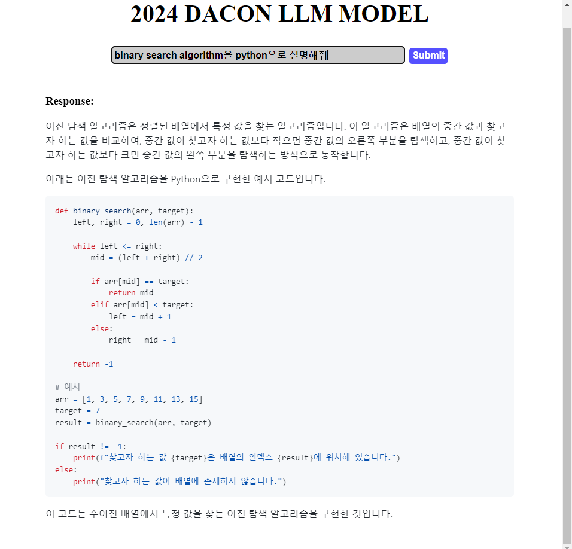

# Hangle
**Search website to compete with Google**

## **INDEX**
[1. FrontEnd](#frontend)  
[1-1. Tech Stack](#tech-stack)  
[1-2. Quick Start](#quick-start)  

[2. BackEnd](#backend)  
[2-1. Tech Stack](#tech-stack-1)  
[2-2. Install Library](#install-library)  
[2-3. Quick Start](#quick-start-1)  

## FrontEnd
<u>**More detail on `/backend/README.md`**</u> 



### Tech Stack
ReactTS + Vite

### Quick Start
- **Run on localhost**
```console
$ yarn dev
```

- **Run on other address**
```console
$ yarn dev --host 0.0.0.0
```

---
## BackEnd
<u>**More detail on `/frontend/README.md`**</u>

### Tech Stack
| Tech | Language |
|:--:|:--:|
| Server | FastAPI |
| LLM | Pytorch |

### Install Library
```console
$ pip3 install -r requirements.txt
```

### Quick Start
1. **Make the file `.env`**
2. **Edit the `.env` file in the following format.**
```
MODEL="gpt-3.5-turbo"
API_KEY="CHATGPT API KEY"
```

**Run BE Server**
```console
$ fastapi dev server.py
```